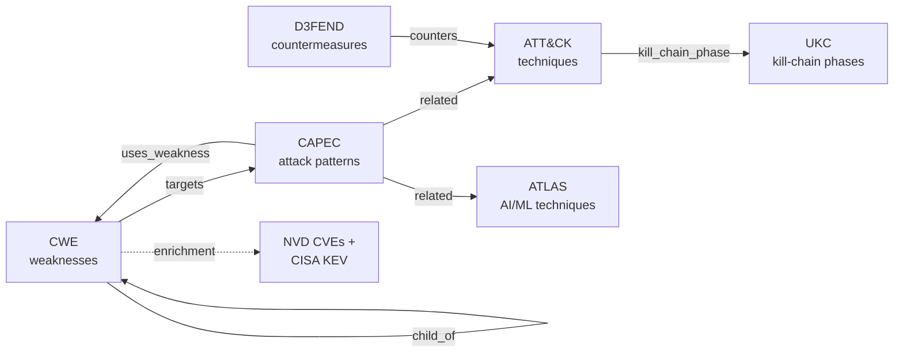

# 01 · Introduction

## What Crossview is

Crossview is two things that share one database layer and one CLI:

1. **A cross-referenced MITRE knowledge silo.** It downloads, normalizes, and links the canonical MITRE security taxonomy into a single offline graph you can query by ID, search full-text, and traverse edge-by-edge.
2. **A 5-stage code scanner.** It walks a real codebase, runs industry SAST tooling, and threads every finding through that MITRE graph — then intersects it with actively-exploited CVEs (NVD + CISA KEV) to tell you not just "this is a bug" but "this is *this* weakness, reachable from *this* entry point, exploited in the wild *right now*, and *this* is how you defend it."

It is **SecGuru's big brother**: where SecGuru reviews documents and designs, Crossview scans live code against the full MITRE graph and produces machine-readable, exploit-prioritized output.


## Why it exists

A raw SAST finding ("Bandit B608: possible SQL injection at `db.py:42`") is low-information. Crossview's thesis is that a finding becomes *actionable* only once it is **cross-referenced**:

- **Up the weakness hierarchy** — what CWE class is this, and what's its parent?
- **Across to attack patterns** — which CAPEC abuse this weakness?
- **Across to adversary behavior** — which ATT&CK / ATLAS techniques chain from those patterns?
- **Across to defenses** — which D3FEND countermeasures apply?
- **Across to the kill chain** — where in the Unified Kill Chain does this sit?
- **Out to the real world** — are there NVD CVEs for this CWE, and are any in CISA's Known Exploited Vulnerabilities catalog?

Crossview pre-computes the static half of that graph once (the silo) and joins the live half (CVEs/KEV, your code) on demand.

## The knowledge graph

The silo unifies six MITRE sources into one entity table connected by typed edges:

| Source | What it contributes | Example IDs |
|---|---|---|
| **CWE** | Software & hardware weaknesses, with a class/base/variant hierarchy | `CWE-89`, `CWE-79` |
| **CAPEC** | Attack patterns that exploit weaknesses | `CAPEC-66`, `CAPEC-108` |
| **ATT&CK** | Adversary tactics & techniques — Enterprise, Mobile, ICS | `T1059`, `T1110` |
| **ATLAS** | Adversarial threats to AI/ML systems | `AML.T0051` |
| **D3FEND** | Defensive countermeasures | `D3F:Token_Binding` |
| **UKC** | Unified Kill Chain phases/stages | `UKC-7` |

Edges are directed and typed — `child_of`, `targets`, `uses_weakness`, `related`, `counters`, `mitigates`, `chains_to`, `kill_chain_phase`:



A representative traversal:

```text
CWE-89 (SQL Injection)
  ├─ child_of ────────▶ CWE-74  (Injection)
  ├─ targets ─────────▶ CAPEC-66 (SQL Injection attack pattern)
  │                        └─ related ──▶ T1190 (Exploit Public-Facing App)
  │                                          └─ counters ◀── D3F mitigation
  └─ (enrichment) ────▶ CVE-2024-… (CVSS 9.8, in CISA KEV)
```

A live silo holds **~3,700 entities** (run `crossview dev stats` for the exact breakdown).

## The scanner's mental model

The scanner is **hypothesis-driven**, not just a linter. Each SAST finding seeds a *hypothesis* ("this pattern suggests CWE-89 here"), and the pipeline's job is to **enrich, prioritize, and verify** that hypothesis against the graph and the live code:

```text
Stage 1  SURVEY       Map the codebase: entry points (untrusted input) + sinks (dangerous ops)
Stage 2  PREMATCH     Run Bandit/Semgrep/secrets/IaC/deps → each finding seeds a hypothesis
Stage 3  INVESTIGATE  Walk CWE→CAPEC→ATT&CK→ATLAS→D3FEND→UKC; pull CVEs/KEV; score priority
Stage 4  VERIFY       Re-survey live code: is the sink still there, reachable from an entry point?
Stage 5  REPORT       Emit Markdown + SARIF + STIX + VEX; TRIAGE filters to production exploit paths
```

Every stage persists to a **per-project** database (`<project>/.crossview/cohort.db`), so the work is resumable, inspectable, and idempotent — you can re-run any single stage.

## The three databases

Crossview keeps reference knowledge, cached enrichment, and per-project findings in separate SQLite files so each can have its own lifecycle:

| DB | Holds | Lifecycle |
|---|---|---|
| **Reference** (`crossview.db`) | The canonical MITRE graph | Rebuilt by `crossview update` |
| **Enrichment** (`enrichment.db`) | CVEs, CWE↔CVE links, CPEs, CISA KEV, web-research cache | Mutable TTL cache |
| **Cohort** (`<project>/.crossview/cohort.db`) | One project's survey + findings + hypotheses + evidence | Per project, never auto-deleted |

See the [Architecture guide](06-architecture.md) and [Data Model](08-data-model.md) for the full picture.

## When to reach for Crossview

**Good fits**

- "Tell me everything about CWE-89 / CAPEC-66 / T1059 / AML.T0051."
- "Is this weakness actively exploited? What CVEs map to it?"
- "Scan this service and tell me what's genuinely reachable and dangerous."
- "Produce a SARIF/STIX security report for this repo."
- "What ATLAS techniques apply to this prompt-injection surface?"

**Poor fits**

- General architecture or non-security code review — Crossview is security-specific.
- Open-ended web research not anchored to an entity ID — its web enricher is a *targeted* per-entity cache, not an exploratory crawler.

## Where to go next

- See the interface: [UI Screens](15-ui-screens.md) — the TUI, the GraphQL web UI, and the reports.
- New here and want it running: [Installation & Setup](02-installation.md).
- Want to use it: [User Guide](03-user-guide.md).
- Building on top of it: [API Guide](05-api-guide.md).
- Curious how it works inside: [Architecture](06-architecture.md) → [Scanner Pipeline](07-scanner-pipeline.md).
- Where it's heading: [Vision](14-vision.md) — the multispectrum console.
