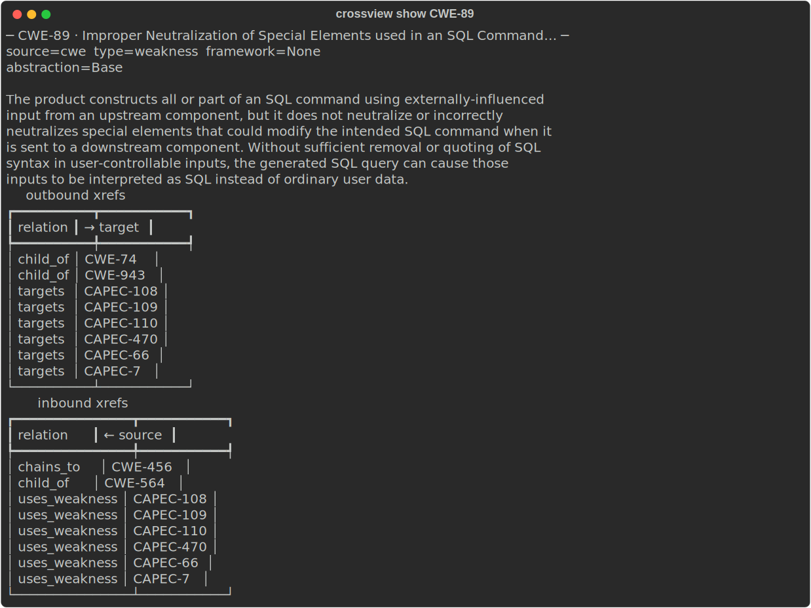
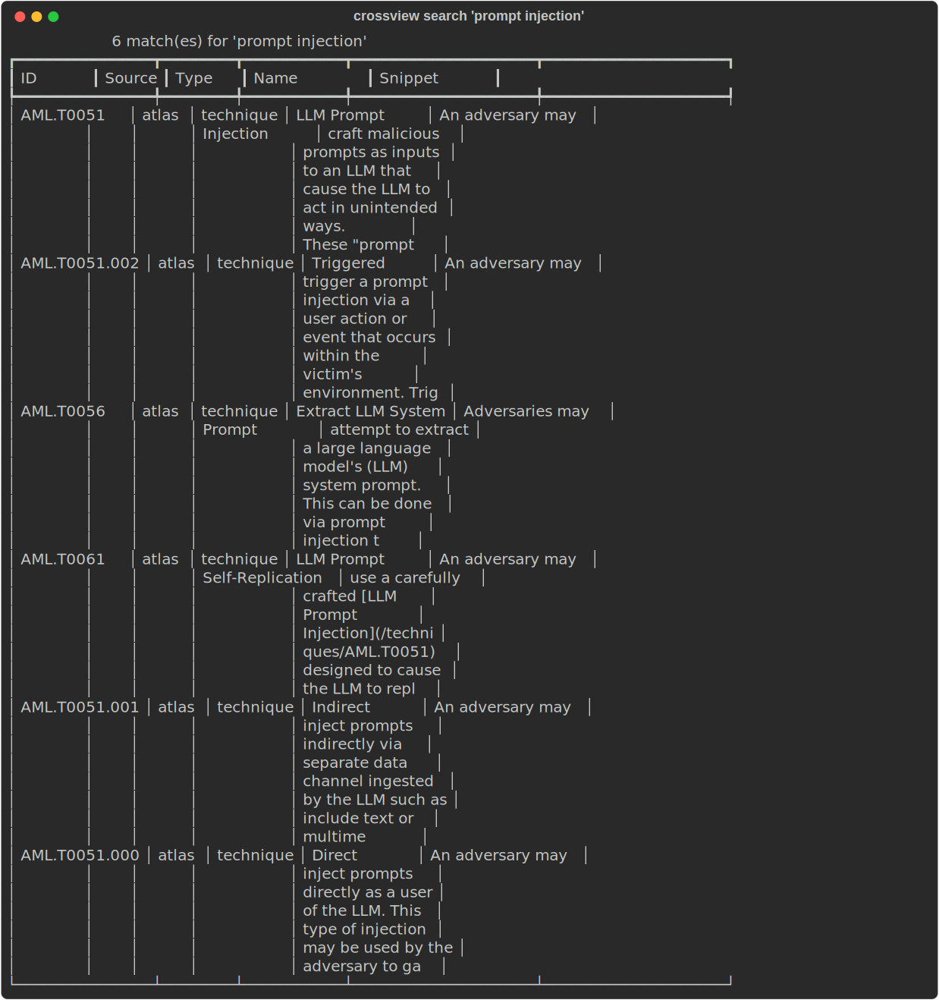
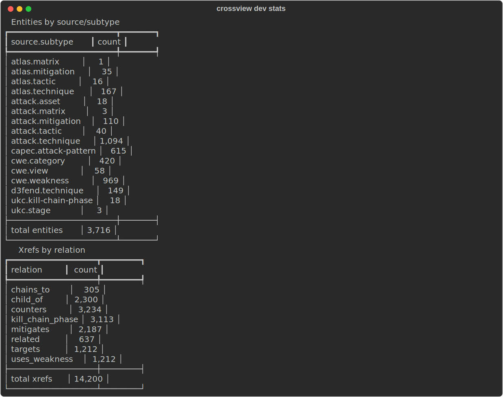
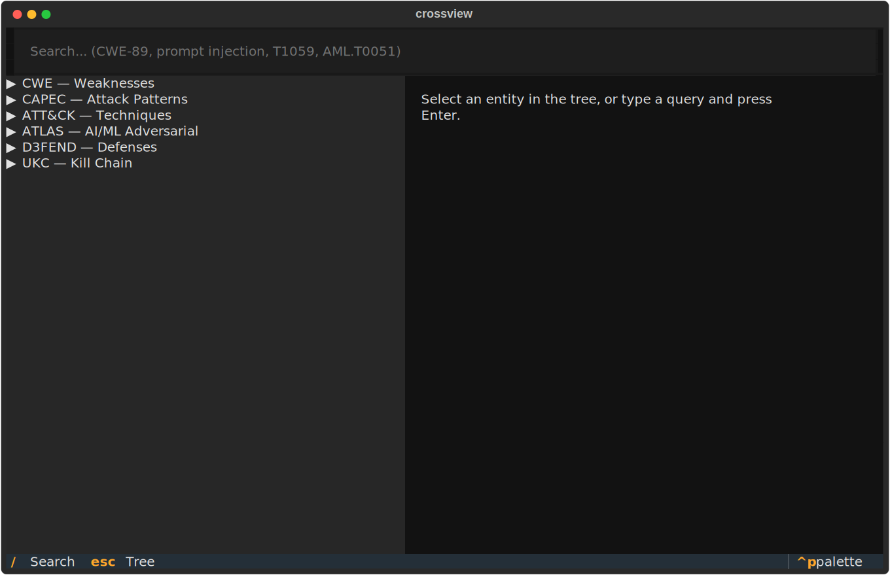

# 03 · User Guide

This guide walks through the things you'll actually do with Crossview: explore the MITRE silo, check what's exploited, scan a codebase, and read the output. For an exhaustive flag reference see the [CLI Reference](04-cli-reference.md).

Assumes you've installed Crossview and run `crossview update` ([Installation](02-installation.md)).

---

## Part 1 — Exploring the knowledge silo

These commands work entirely offline against the reference DB. No scan or network needed.

### Look up an entity

```bash
crossview show CWE-89
```

Prints the entity's name, source/subtype, abstraction, description, and **both directions** of its cross-references — outbound (what it points to) and inbound (what points to it):



It accepts any canonical ID:

```bash
crossview show CAPEC-66          # an attack pattern
crossview show T1059             # an ATT&CK technique
crossview show AML.T0051         # an ATLAS (AI/ML) technique
crossview show D3F:Token_Binding # a D3FEND countermeasure
crossview show UKC-7             # a Unified Kill Chain phase
```

### Search the silo

```bash
crossview search "sql injection"
crossview search "prompt injection" -n 5     # cap results
```

Full-text search (FTS5) across entity names and descriptions, ranked by relevance:



### Trace cross-references

```bash
crossview dev xref CWE-89        # every one-hop edge out from an entity
crossview dev orphans            # entities with zero xrefs (normalizer gaps)
crossview dev stats              # counts per source/subtype + xrefs by relation
```

`crossview dev stats` gives you the silo at a glance — entity counts per source/subtype and cross-references by relation:



---

## Part 2 — Real-world exploitation context

This is where the silo meets live threat intel. Requires enrichment data — see [Enrichment](10-enrichment.md) to populate it.

### "Is this weakness actively exploited?"

```bash
crossview enrich CWE-78
```

Pulls the NVD CVEs that map to CWE-78 and intersects them with **CISA KEV** (Known Exploited Vulnerabilities — confirmed exploited in the wild), ranked by CVSS. A non-empty KEV intersection is your strongest "fix this now" signal.

### Inspect one CVE

```bash
crossview cve CVE-2024-3094
```

Shows the CVE's description, CVSS, the CWEs it's classified under, and its affected CPE (platform) list.

### Distill a MITRE page into JSON (web research)

```bash
crossview research AML.T0051
```

Fetches the canonical MITRE page for that entity via crawl4ai and caches a distilled JSON payload in `enrichment.db`. This is **targeted** per-entity caching — for open-ended exploratory research, use a dedicated research tool instead.

---

## Part 3 — Scanning a codebase

### The fast path

```bash
crossview scan /path/to/project
```

Runs all five stages and writes three reports into the project root:

- `CROSSVIEW-REPORT.md` — the human-readable report
- `CROSSVIEW-REPORT.html` / `.pdf` — a client-grade, print-ready report (PDF when a renderer is available)
- `CROSSVIEW.sarif` — for CI/IDE ingestion
- `CROSSVIEW.stix.json` — for threat-intel pipelines

> **`scan` is path-sensitive.** Pass an absolute path, or `cd` into the project first. Survey/verify also re-read files relative to that path.

Handy `scan` flags:

```bash
crossview scan /proj --out /tmp/reports      # write reports elsewhere
crossview scan /proj --skip-semgrep          # Bandit-only code stage (faster)
crossview scan /proj --web-research 5         # crawl4ai the top 5 high-priority CWEs
crossview scan /proj --stop-after investigate # stop before verify/report
```

### Running stages individually

The pipeline is resumable and each stage is idempotent, so you can drive it by hand — useful for large repos or debugging:

```bash
crossview survey /proj            # 1. map entry points + sinks
crossview prematch /proj          # 2a. Bandit + Semgrep
crossview prematch-secrets /proj  # 2b. detect-secrets (+ trufflehog/gitleaks)
crossview prematch-iac /proj      # 2c. Trivy + Hadolint
crossview prematch-deps /proj     # 2d. OSV-Scanner → CVE enrich
crossview investigate /proj       # 3. graph walk + priority scoring
crossview verify /proj            # 4. reachability re-check
crossview report /proj            # 5. emit reports
```

Re-running `investigate` rewrites that project's evidence/validation rows; re-running `verify` resets and re-classifies statuses. Nothing is destructive to the silo — only the project's own `cohort.db` changes.

### What the five stages actually do (in brief)

| Stage | In one sentence |
|---|---|
| **Survey** | Walks the tree and records *entry points* (where untrusted input arrives — HTTP routes, CLI commands, schedulers) and *sinks* (dangerous operations — SQL exec, shell exec, eval, LLM calls). |
| **Prematch** | Runs the SAST tools; every finding becomes a *hypothesis* ("this looks like CWE-X here") seeded with a starting confidence. |
| **Investigate** | For each hypothesis, walks CWE→CAPEC→ATT&CK→ATLAS→D3FEND→UKC, pulls related CVEs/KEV, and computes a **priority score**. |
| **Verify** | Re-surveys the live code to ask: is the sink still there, and is it reachable from an entry point? Marks each hypothesis **confirmed / partial / rejected**. |
| **Report** | Emits the confirmed/partial findings as Markdown + SARIF + STIX. |

The deep version is in the [Scanner Pipeline guide](07-scanner-pipeline.md).

---

## Part 4 — Production triage

When you only care about what's exploitable in *production* code (not tests, fixtures, build output, or examples):

```bash
crossview triage /path/to/project
```

Triage takes the confirmed findings, classifies each file path (`production` vs `test` / `dev` / `build` / `config_template` / `doc`), drops the non-production ones, and ranks what's left into urgency buckets:

1. **Verified-live secrets** — re-runs TruffleHog with live verification (`--results=verified`) to confirm a credential still authenticates *right now*.
2. **KEV intersect** — findings whose CWE has a CVE in CISA KEV.
3. **ATLAS / LLM** — AI-specific input-flow findings (CWE-1426 or `AML.T` references).
4. **Other production findings.**

Output: `CROSSVIEW-TRIAGE.md`. Skip the live secret re-check with `--no-verify-secrets`; redirect output with `--out <path>`.

---

## Part 5 — Reading the reports

### `CROSSVIEW-REPORT.md`

Split into **Confirmed** and **Partial** sections. Each finding shows:

- `file:line`, the rule that fired (`rule_source/rule_id`), and severity
- the anchoring **CWE**
- a **cross-source chain table**: CAPEC → ATT&CK → ATLAS → D3FEND
- **external signal**: top related CVEs and whether any are in CISA KEV
- **D3FEND mitigation** links — what to do about it

A methodology section at the end documents the 5-stage process for reviewers.

### `CROSSVIEW.sarif`

OASIS SARIF 2.1.0. Confirmed findings map to `error`, partial to `warning`. Each result carries `crossview`-namespaced properties (status, confidence, the canonical entities) so downstream tools can surface the MITRE context. Ingest it into your IDE or CI code-scanning view.

### `CROSSVIEW.stix.json`

STIX 2.1, **confirmed findings only**. Each becomes a `vulnerability` object with external CWE references and relationships (`exploited-using` CAPEC, `mitigated-by` D3FEND) — feed it to a TIP or graph tool.

---

## Part 6 — The TUI

```bash
crossview tui
```

A Textual terminal app: tree views of the silo by source, full-text search, and a detail panel for the selected entity and its xrefs. Good for interactive exploration when you don't yet know the exact ID you want.



---

## Typical end-to-end session

```bash
# One-time setup
crossview update
crossview enrich --enricher cisa_kev

# Investigate a weakness before you even scan
crossview show CWE-89
crossview enrich CWE-89

# Scan a service, then narrow to production exploit paths
cd ~/src/my-service
crossview scan .
crossview triage .

# Read the output
$EDITOR CROSSVIEW-REPORT.md CROSSVIEW-TRIAGE.md
```

Next: the [CLI Reference](04-cli-reference.md) for every flag, or the [API Guide](05-api-guide.md) to script it.
