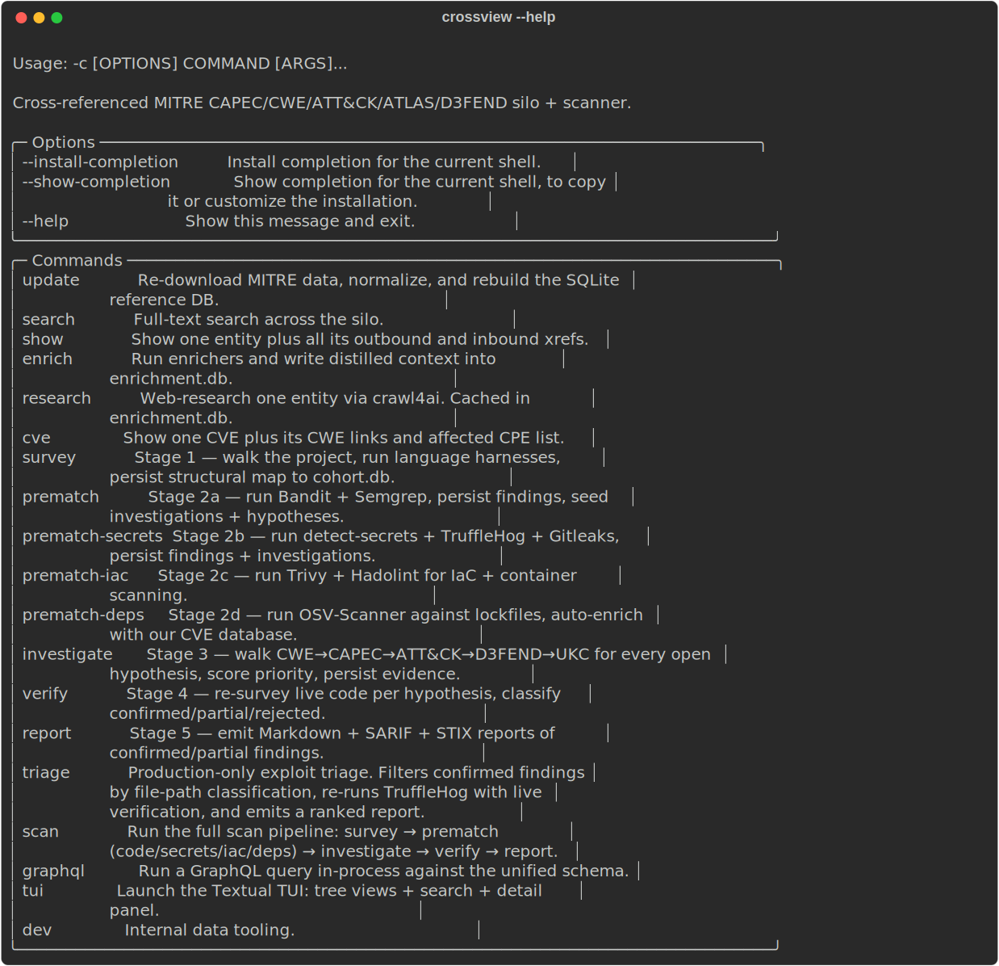

# 04 · CLI Reference

Every Crossview command, argument, and flag. The CLI is a [Typer](https://typer.tiangolo.com) app exposed as `crossview` (entry point `crossview.cli:app`).

Run `crossview --help` or `crossview <command> --help` at any time for the live version.



```text
crossview
├── update            rebuild the MITRE reference DB
├── search            full-text search the silo
├── show              show one entity + xrefs
├── enrich            run enrichers (CVE/KEV) into enrichment.db
├── research          web-research one entity (crawl4ai)
├── cve               show one CVE + CWEs + CPEs
├── survey            scan stage 1
├── prematch          scan stage 2a (code SAST)
├── prematch-secrets  scan stage 2b (secrets)
├── prematch-iac      scan stage 2c (IaC / containers)
├── prematch-deps     scan stage 2d (dependency CVEs)
├── investigate       scan stage 3 (graph walk)
├── verify            scan stage 4 (reachability)
├── report            scan stage 5 (emit reports)
├── triage            production-only exploit triage
├── scan              run the full pipeline
├── graphql           run a GraphQL query in-process
├── tui               launch the Textual TUI
└── dev               internal data tooling (subcommands)
```

---

## Knowledge & enrichment

### `update`
Re-download MITRE data, normalize, and rebuild the SQLite reference DB.

```bash
crossview update [--only KEY]... [--force] [--skip-download]
```

| Option | Effect |
|---|---|
| `--only TEXT` | Only refresh these source keys (repeatable): `--only capec --only cwe`. Keys: `capec`, `cwe`, `attack-enterprise`, `attack-mobile`, `attack-ics`, `d3fend-mappings`, `d3fend-ontology`, `atlas`. |
| `--force` | Re-download even if a cached copy exists. |
| `--skip-download` | Use already-cached raw files; just rebuild the DB. |

### `search`
Full-text search across the silo.

```bash
crossview search QUERY [-n/--limit N]
```

- `QUERY` (required) — search string.
- `--limit, -n INTEGER` — max results (default 20).

### `show`
Show one entity plus all its outbound and inbound xrefs.

```bash
crossview show ENTITY_ID
```

- `ENTITY_ID` (required) — e.g. `CWE-89`, `CAPEC-66`, `T1059`, `AML.T0051`, `D3F:Token_Binding`, `UKC-7`.

### `enrich`
Run enrichers and write distilled context into `enrichment.db`.

```bash
crossview enrich [ENTITY_ID] [-e/--enricher NAME] [--force]
```

- `ENTITY_ID` (optional) — entity to enrich (e.g. `CWE-89`). Omit to run **global** enrichers.
- `--enricher, -e TEXT` — run a specific enricher: `cisa_kev`, `cve_nvd_bulk`, `web_research`. Default: all applicable.
- `--force` — bypass the TTL cache and refetch.

For a CWE argument, this surfaces the ranked NVD CVEs and the CISA KEV intersection. See [Enrichment](10-enrichment.md).

### `research`
Web-research one entity via crawl4ai. Cached in `enrichment.db`.

```bash
crossview research ENTITY_ID [--force]
```

- `ENTITY_ID` (required).
- `--force` — bypass cache.

### `cve`
Show one CVE plus its CWE links and affected CPE list.

```bash
crossview cve CVE_ID
```

- `CVE_ID` (required) — e.g. `CVE-2024-3094`.

---

## Scanning

All scan commands take a directory `PATH` (must exist). Reports and per-project state are written under `PATH` unless redirected.

### `scan`
Run the full pipeline: survey → prematch (code/secrets/iac/deps) → investigate → verify → report.

```bash
crossview scan PATH [--out DIR] [--skip-semgrep] [-W/--web-research N] [--stop-after STAGE]
```

| Option | Effect |
|---|---|
| `--out DIR` | Where to write reports. Defaults to `PATH/`. |
| `--skip-semgrep` | Skip the Semgrep half of stage 2a (Bandit only). |
| `--web-research, -W N` | Run crawl4ai for the top **N** high-priority CWEs during investigate (default 0). |
| `--stop-after STAGE` | Stop after `survey` \| `prematch` \| `investigate` \| `verify`. |

### Individual stages

| Command | Stage | Notes |
|---|---|---|
| `crossview survey PATH` | 1 | Walk the tree; persist entry points + sinks + project map to `cohort.db`. |
| `crossview prematch PATH` | 2a | Bandit + Semgrep; normalize to SARIF; seed hypotheses. |
| `crossview prematch-secrets PATH` | 2b | detect-secrets + TruffleHog + Gitleaks. |
| `crossview prematch-iac PATH` | 2c | Trivy + Hadolint (skip gracefully if absent). |
| `crossview prematch-deps PATH` | 2d | OSV-Scanner; auto-join to NVD enrichment. |
| `crossview investigate PATH` | 3 | Walk CWE→CAPEC→ATT&CK→D3FEND→UKC; score priority; persist evidence. |
| `crossview verify PATH` | 4 | Re-survey live code; classify confirmed/partial/rejected. |
| `crossview report PATH` | 5 | Emit `CROSSVIEW-REPORT.md` + `.sarif` + `.stix.json`. |

### `triage`
Production-only exploit triage. Filters confirmed findings by file-path classification, re-runs TruffleHog with live verification, and emits a ranked report.

```bash
crossview triage PATH [--no-verify-secrets] [--out PATH]
```

| Option | Effect |
|---|---|
| `--no-verify-secrets` | Skip the live `trufflehog --results=verified` pass. |
| `--out PATH` | Where to write the triage report. Default `PATH/CROSSVIEW-TRIAGE.md`. |

---

## Graph & TUI

### `graphql`
Run a GraphQL query in-process against the unified schema.

```bash
crossview graphql QUERY [--pretty/--no-pretty]
```

- `QUERY` (required) — a GraphQL query string.
- `--pretty/--no-pretty` — pretty-print the JSON result (default pretty).

```bash
crossview graphql '{ entity(id: "CWE-89") { id name source } }'
```

See the [API Guide](05-api-guide.md) for the full schema.

### `tui`
Launch the Textual TUI: tree views + search + detail panel.

```bash
crossview tui
```

---

## `dev` — internal data tooling

Inspect the silo and the raw downloads. Read-only with respect to the silo (except where noted).

| Command | Purpose |
|---|---|
| `crossview dev verify-urls` | HEAD-check every MITRE source URL and report status. |
| `crossview dev inspect FILE` | Print top-level keys, type, and counts for a downloaded JSON file. |
| `crossview dev schema FILE` | Infer field paths and types from a JSON file (per entity type). |
| `crossview dev sample FILE` | Pull N samples per entity type out of a JSON file. |
| `crossview dev stats` | Row counts per source/subtype, plus xref breakdown by relation. |
| `crossview dev validate` | Integrity checks: orphans, dangling xrefs, FTS coverage, duplicate IDs. |
| `crossview dev sql "QUERY"` | Execute a read-only SQL query against the reference DB. |
| `crossview dev xref ENTITY_ID` | Trace every cross-reference path out from an entity (one hop). |
| `crossview dev orphans` | List entities with zero cross-references (possible normalizer gaps). |
| `crossview dev diff A B` | Diff two MITRE snapshots: added/removed/changed entities. |

Examples:

```bash
crossview dev stats
crossview dev sql "SELECT source, COUNT(*) FROM entities GROUP BY source"
crossview dev xref CAPEC-66
crossview dev validate
```

---

## Running without the console script

In a fresh source checkout (or a moved venv with a stale shebang), invoke the app through the interpreter:

```bash
python -c "from crossview.cli import app; app()" <command> [args...]
```

Everything above works identically; only the launcher changes.
