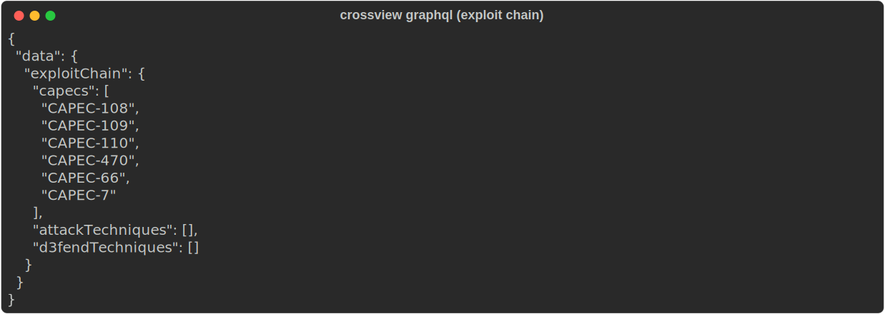
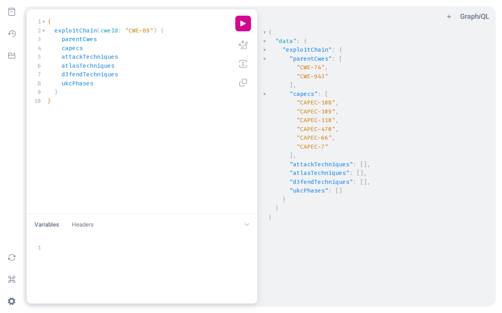

# 05 · API Guide

Crossview exposes two programmatic surfaces:

1. **A GraphQL schema** — a code-first [Strawberry](https://strawberry.rocks) schema that runs **in-process** (no server) over the reference, enrichment, and cohort databases.
2. **A Python API** — stable connection helpers and functions for the data layer and the enrichment orchestrator.

Requires `strawberry-graphql` for the GraphQL surface (declared in `pyproject.toml`).

---

## GraphQL

### Executing queries

From the CLI:

```bash
crossview graphql '{ entity(id: "CWE-89") { id name source } }'
```



From Python:

```python
from crossview.graph.schema import execute

result = execute("""
    query {
        entity(id: "CWE-89") { id name description }
    }
""")
# result == {"data": {"entity": {...}}}
# on failure: {"data": ..., "errors": [{"message": "...", "path": ...}]}
```

`execute(query_str, variables=None) -> dict` runs `schema.execute_sync` and returns a plain dict with a `data` key (and an `errors` key if anything failed). The schema is assembled in `crossview/graph/schema.py` as `strawberry.Schema(query=Query)`. There are **no mutations** — the GraphQL surface is read-only; writes happen through the scan pipeline and the Python API.

### Root query fields

> **Naming:** Strawberry auto-camelCases. The Python resolvers/attributes are snake_case (e.g. `exploit_chain`, `cwe_id`), but the **GraphQL schema exposes camelCase** (`exploitChain`, `cweId`). Use the camelCase names below in queries.

| Field | Arguments | Returns | Reads |
|---|---|---|---|
| `entity` | `id: String!` | `Entity` | reference |
| `search` | `query: String!`, `limit: Int = 20` | `[Entity]` | reference (FTS5) |
| `entitiesBySource` | `source: String!`, `subtype: String`, `limit: Int = 100` | `[Entity]` | reference |
| `xrefsOut` | `entityId: String!` | `[Xref]` | reference |
| `xrefsIn` | `entityId: String!` | `[Xref]` | reference |
| `exploitChain` | `cweId: String!` | `ExploitChain` | reference |
| `cvesForCwe` | `cweId: String!`, `limit: Int = 25` | `[CVE]` | enrichment |
| `kevForCwe` | `cweId: String!` | `[KEVRow]` | enrichment |
| `investigations` | `projectPath: String!`, `status: String`, `limit: Int = 100` | `[Investigation]` | cohort |
| `investigation` | `id: Int!`, `projectPath: String!` | `Investigation` | cohort |
| `hypotheses` | `investigationId: Int!`, `projectPath: String!` | `[Hypothesis]` | cohort |
| `evidence` | `hypothesisId: Int!`, `projectPath: String!` | `[Evidence]` | cohort |
| `validations` | `hypothesisId: Int!`, `projectPath: String!` | `[Validation]` | cohort |

> Cohort fields require a `projectPath` because each scanned project has its own `cohort.db`; the resolver opens the DB at `<project_path>/.crossview/cohort.db`.

### Types

Field names are camelCase in the schema (the Python attribute is shown after `·` where it differs):

```graphql
type Entity {
  id: String!
  source: String!         # cwe | capec | attack | atlas | d3fend | ukc
  subtype: String!        # weakness | attack-pattern | technique | tactic | mitigation | ...
  name: String!
  description: String!
  framework: String       # enterprise | mobile | ics | atlas | null
  abstraction: String     # CAPEC: Standard/Detailed/Meta · CWE: class/base/variant
  stixId: String
}

type Xref {
  srcId: String!
  dstId: String!
  relation: String!       # child_of | targets | uses_weakness | related | counters | ...
  source: String!
}

type ExploitChain {       # aggregated cross-source view rooted at a CWE
  cweId: String!
  parentCwes: [String!]!
  capecs: [String!]!
  attackTechniques: [String!]!
  atlasTechniques: [String!]!
  d3fendTechniques: [String!]!
  ukcPhases: [String!]!
}

type CVE {
  cveId: String!
  description: String!
  cvssV3Score: Float
  cvssV3Severity: String
  publishedAt: String
  inKev: Boolean!
}

type KEVRow {
  cveId: String!
  vendorProject: String
  product: String
  vulnerabilityName: String
  dateAdded: String
  shortDescription: String
  knownRansomwareUse: String
}

type Investigation {
  id: Int!
  projectPath: String!
  filePath: String
  lineStart: Int
  lineEnd: Int
  summary: String!
  status: String!
  openedAt: String!
}

type Hypothesis {
  id: Int!
  investigationId: Int!
  parentId: Int
  statement: String!
  confidence: Float!
  suspectedCwe: String
  suspectedCapec: String
  suspectedAttack: String
  suspectedAtlas: String
  status: String!
  postedAt: String!
}

type Evidence {
  id: Int!
  hypothesisId: Int!
  kind: String!           # mitre_xref | external_ref | test_result | ...
  content: String!
  filePath: String
  line: Int
  refUrl: String
  createdAt: String!
}

type Validation {
  id: Int!
  hypothesisId: Int!
  entityType: String!     # cwe | capec | attack | atlas | d3fend | ukc
  entityId: String!
  match: String!
  notes: String
  createdAt: String!
}
```

### Example queries

This is the `exploitChain` query captured live in the GraphiQL playground below:



**Search + full exploit chain for one CWE**

```graphql
query {
  search(query: "SQL injection", limit: 5) { id name source }
  exploitChain(cweId: "CWE-89") {
    cweId
    parentCwes
    capecs
    attackTechniques
    atlasTechniques
    d3fendTechniques
    ukcPhases
  }
}
```

**Real-world exploitation signal for a CWE**

```graphql
query {
  cvesForCwe(cweId: "CWE-89", limit: 10) {
    cveId cvssV3Score cvssV3Severity inKev publishedAt
  }
  kevForCwe(cweId: "CWE-89") {
    cveId vendorProject product dateAdded knownRansomwareUse
  }
}
```

**Walk a project's findings**

```graphql
query {
  investigations(projectPath: "/abs/path/to/project", status: "validated", limit: 20) {
    id summary filePath lineStart status
  }
}
```

---

## Python API

The data layer is plain `sqlite3` with `Row` factories — every `connect()` returns a connection whose rows behave like dicts. All write paths use a `transaction()` context manager that commits on success and rolls back on exception.

### Reference DB — `crossview.data.database`

```python
from crossview.data.database import connect, stats, init_schema, \
    insert_entities, insert_xrefs, rebuild_fts, transaction

conn = connect()                 # opens <data-dir>/crossview.db
print(stats(conn))               # {source.subtype: count, ...} + xref relation counts

# Bulk loading (what `crossview update` does internally):
with transaction(conn):
    insert_entities(conn, entities)   # Iterable[crossview.domain Entity]
    insert_xrefs(conn, xrefs)         # Iterable[crossview.domain Xref]
rebuild_fts(conn)                     # repopulate the FTS5 mirror after a load
```

`init_schema(conn)` drops and recreates the reference schema — destructive; only used by a full rebuild.

### Enrichment DB — `crossview.enrichment.cache`

```python
from crossview.enrichment.cache import connect, get_enrichment, \
    upsert_enrichment, is_stale, stats

conn = connect()                 # opens <data-dir>/enrichment.db
rec = get_enrichment(conn, "CWE-89", "web_research")
if is_stale(rec):
    ...                          # refetch
upsert_enrichment(conn, "CWE-89", "web_research", payload={...}, ttl_seconds=86400)
print(stats(conn))               # cves, cwe_cves, cpes, cve_cpes, kev, enrichments_by_enricher
```

`get_enrichment` returns `{"payload": dict, "fetched_at": str, "ttl_seconds": int|None, "fingerprint": str|None}` or `None`. The `sweep_state` helpers (`load_sweep_state` / `save_sweep_state`) back the resumable NVD bulk import.

### Cohort DB — `crossview.data.cohort`

```python
from pathlib import Path
from crossview.data import cohort

conn = cohort.connect(Path("/abs/path/to/project"))   # opens .crossview/cohort.db, auto-inits schema
# Join per-project findings against canonical entities:
cohort.attach_reference(conn, reference_db_path, alias="ref")
rows = conn.execute("""
    SELECT h.statement, e.name
    FROM hypotheses h
    JOIN ref.entities e ON h.suspected_cwe = e.id
    WHERE h.status = 'confirmed'
""").fetchall()
```

`cohort.connect()` is **non-destructive** — it creates the DB and schema on first use and never drops it. `cohort_path(project_root)` resolves the `.crossview/cohort.db` location.

### Enrichment orchestrator — `crossview.enrichment.orchestrator`

Run enrichers programmatically. Sync wrappers exist so you don't need an event loop.

```python
from crossview.enrichment.orchestrator import (
    run_enricher_sync, run_all_global_sync, ALL_ENRICHERS,
)

# Registry: {"cisa_kev": ..., "cve_nvd_bulk": ..., "web_research": ...}
res = run_enricher_sync("cisa_kev")                       # global enricher
res = run_enricher_sync("web_research", entity_id="CWE-89")  # per-entity enricher
run_all_global_sync(force=False)                          # every global enricher once

print(res.enricher, res.entity_id, res.payload, res.notes)
```

Each call returns an `EnrichmentResult` (`crossview.enrichment.enrichers.base`):

```python
@dataclass
class EnrichmentResult:
    enricher: str
    entity_id: str | None = None
    payload: dict = ...
    notes: list[str] = ...
    side_effects: dict = ...
```

Global enrichers (`cisa_kev`, `cve_nvd_bulk`) take no `entity_id`; per-entity enrichers (`web_research`) require one. Results are cached in `enrichment.db` subject to TTL unless `force=True`.

---

## Stability notes

- The **GraphQL schema** and the **`connect()` / `transaction()` helpers** are the intended integration points — prefer them over hand-rolling SQL against the files.
- Table layouts are documented in the [Data Model](08-data-model.md), but treat raw SQL as lower-level than the helpers above.
- The GraphQL surface is read-only by design. To *write* findings, run the scan pipeline (or its stage functions under `crossview.scanner.*`).
