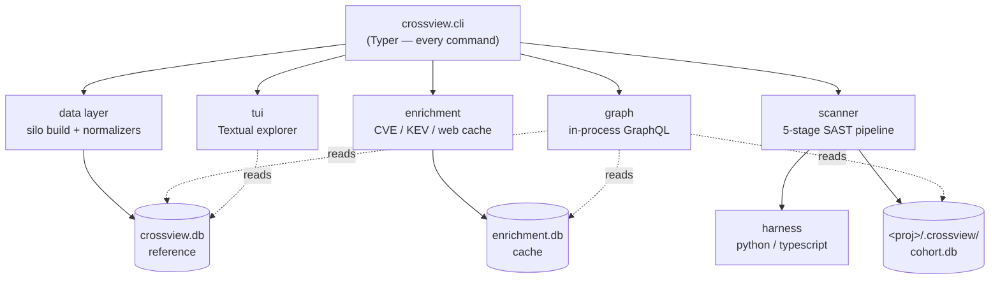

# 06 · Architecture

A map of how Crossview is put together — the modules, the three databases, and the data flow that turns MITRE source files and a codebase into an exploit-prioritized report.

## High-level shape



The same structure as ASCII, for renderers without Mermaid:

```text
              ┌─────────────────────────────────────────────────────────┐
              │                      crossview.cli                       │
              │              (Typer app — every command)                 │
              └───────┬───────────────┬──────────────────┬──────────────┘
                      │               │                  │
            ┌─────────▼──────┐ ┌──────▼───────┐ ┌────────▼─────────┐
            │   data layer   │ │  enrichment  │ │     scanner      │
            │  (silo build,  │ │ (CVE/KEV/web │ │  (5-stage SAST   │
            │   normalizers) │ │   cache)     │ │    pipeline)     │
            └───┬───────┬────┘ └──────┬───────┘ └───┬─────────┬────┘
                │       │             │             │         │
                │  ┌────▼────┐  ┌─────▼─────┐  ┌────▼────┐ ┌──▼───────┐
                │  │ harness │  │ enrichers │  │  graph  │ │   tui    │
                │  │ (py/ts) │  │           │  │(GraphQL)│ │(Textual) │
                │  └─────────┘  └───────────┘  └─────────┘ └──────────┘
                ▼
      ┌──────────────────┐  ┌──────────────────┐  ┌────────────────────────┐
      │  crossview.db    │  │  enrichment.db   │  │ <proj>/.crossview/      │
      │  (reference)     │  │  (cache)         │  │   cohort.db (per-proj)  │
      └──────────────────┘  └──────────────────┘  └────────────────────────┘
```

## Package layout

```text
crossview/
├── cli.py                 # Typer CLI — every command is defined here
├── domain/                # dataclasses: Entity, Xref + the Source/Subtype/Relation taxonomies
├── data/                  # silo build + storage
│   ├── sources.py         #   MITRE source URLs + formats
│   ├── downloader.py      #   fetch raw files into <data-dir>/raw/
│   ├── normalizers/       #   per-source parsers → Entity/Xref (stix, cwe-xml, d3fend, ukc, …)
│   ├── loader.py          #   orchestrates normalizers → DB
│   ├── database.py        #   reference DB schema + connect/insert/stats/FTS
│   ├── cohort.py          #   per-project cohort DB schema + connect/attach
│   └── paths.py           #   portable <data-dir> resolution
├── enrichment/            # live threat-intel cache
│   ├── enrichers/         #   cisa_kev, cve_nvd, web_research (+ base)
│   ├── orchestrator.py    #   registry + run_enricher / run_all_global (+ sync wrappers)
│   ├── cache.py           #   enrichment DB schema + upsert/get/sweep-state
│   └── paths.py
├── scanner/               # the 5-stage pipeline
│   ├── survey.py          #   stage 1
│   ├── prematch_code.py   #   stage 2a (Bandit + Semgrep)
│   ├── prematch_secrets.py#   stage 2b
│   ├── prematch_iac.py    #   stage 2c
│   ├── prematch_deps.py   #   stage 2d
│   ├── investigate.py     #   stage 3 (graph walk + scoring)
│   ├── verify.py          #   stage 4 (reachability)
│   ├── reporter.py        #   stage 5 (Markdown/SARIF/STIX)
│   ├── triage.py          #   production exploit triage
│   ├── preset_selector.py #   choose rule packs by language/framework
│   ├── sarif_ingest.py    #   normalize any SARIF → Finding
│   ├── bandit_ingest.py   #   parse Bandit's native JSON → Finding
│   └── tooling.py         #   portable external-tool resolution
├── harness/               # language analysis for survey + verify
│   ├── base.py            #   Entrypoint / Sink dataclasses + Harness protocol
│   ├── orchestrator.py    #   directory walk + per-file dispatch
│   ├── python/            #   AST-based: routes.py, sinks.py, ast_walker.py
│   └── typescript/        #   ast-grep / regex based
├── graph/                 # in-process GraphQL
│   ├── schema.py          #   Query type + execute()
│   ├── types.py           #   Strawberry types
│   └── resolvers/         #   entity.py, cohort.py, exploit_chain.py
├── tui/                   # Textual app
└── dev/                   # data-tooling subcommands (inspect/schema/sample/validate/...)
```

## The three databases and their lifecycles

Crossview deliberately splits state into three SQLite files so each can be rebuilt, cached, or discarded independently. All three use `Row` factories; writes go through `transaction()`.

### 1. Reference — `crossview.db`

The canonical MITRE graph. **Read-mostly**, rebuilt wholesale by `crossview update`.

- `entities(id, source, subtype, name, description, framework, abstraction, stix_id, …, raw_json)`
- `xrefs(src_id, dst_id, relation, source, metadata_json)` — directed typed edges
- `entities_fts` — FTS5 mirror of name+description for `search`

Built by: `downloader` → `normalizers/*` → `loader` → `database.insert_*` → `rebuild_fts`. Lives in `<data-dir>` (see [Installation → Data directory](02-installation.md#data-directory)).

### 2. Enrichment — `enrichment.db`

A TTL cache of live threat intel and a generic per-entity payload store. **Append-mostly**, mutable.

- `cves`, `cwe_cves`, `cpes`, `cve_cpes` — the NVD slice
- `kev` — CISA Known Exploited Vulnerabilities (with a `cwe_ids_json` array)
- `enrichments` — generic `(entity_id, enricher) → payload_json` with `ttl_seconds`/`fingerprint`
- `sweep_state` — resumable bulk-import progress

Populated by the enrichers; queried by stage 3 (investigate), triage, and the `cves_for_cwe` / `kev_for_cwe` GraphQL resolvers. Co-located with the reference DB in `<data-dir>`.

### 3. Cohort — `<project>/.crossview/cohort.db`

One database **per scanned project**. Holds the entire investigation lifecycle. **Never auto-deleted**, idempotently rewritten per stage.

- Stage 1: `project_map`, `entrypoints`, `sinks`
- Stage 2: `scan_results`
- Lifecycle: `investigations` → `hypotheses` → `evidence`, `validations`, `mitigations`, `notes`

It does not duplicate canonical data — it *references* it by ID (`hypotheses.suspected_cwe = "CWE-89"`), and can `ATTACH` the reference DB as `ref` to JOIN canonical names in.

Full column-level schemas are in the [Data Model guide](08-data-model.md).

## How the databases reference each other

```text
   cohort.db                         crossview.db                 enrichment.db
   ─────────                         ────────────                 ─────────────
   hypotheses.suspected_cwe ───────▶ entities.id  (CWE-89)
   scan_results.cwe_id      ───────▶ entities.id
   validations.entity_id    ───────▶ entities.id
                                     entities.id (CWE-89) ◀────── cwe_cves.cwe_id ──▶ cves.cve_id
                                                                  kev.cwe_ids_json  ──▶ "CWE-89"
```

The reference DB is the hub: cohort findings point *into* it by entity ID, and enrichment rows point *into* it the same way. Nothing points back out, which keeps the reference DB a pure, rebuildable source of truth.

## Data flow: from sources to report

```text
MITRE sources ──downloader──▶ raw/*.json ──normalizers──▶ Entity/Xref ──loader──▶ crossview.db
                                                                                      │
NVD + CISA ────enrichers────────────────────────────────────────────────────▶ enrichment.db
                                                                                      │
your code ──survey──▶ entrypoints/sinks ──prematch──▶ scan_results ──┐               │
                                            (Bandit/Semgrep/…)        │               │
                                                                     ▼               │
                                              investigations → hypotheses            │
                                                                     │  investigate  │
                                                                     │  walks ───────┘ (reads both ref + enrichment)
                                                                     ▼
                                              evidence + validations + priority score
                                                                     │  verify (re-survey live code)
                                                                     ▼
                                              confirmed / partial / rejected
                                                                     │  report / triage
                                                                     ▼
                                       CROSSVIEW-REPORT.md · .sarif · .stix.json · CROSSVIEW-TRIAGE.md
```

## Design principles

- **Separation of canonical vs. cached vs. per-project state.** Three DBs, three lifecycles. You can `rm` the cohort DB without touching the silo, rebuild the silo without losing enrichment, etc.
- **The reference DB is rebuildable and read-mostly.** All mutation happens in enrichment (cache) and cohort (work product).
- **Hypothesis-driven, idempotent stages.** Every scan stage can be re-run; it resets and rewrites its own rows rather than appending duplicates.
- **Graceful degradation.** Optional external tools, optional enrichment, optional harness libraries — each missing piece narrows coverage with a log line rather than failing the run.
- **Portable resolution.** Data dir and external-tool paths resolve across source checkouts, venvs, and read-only installs (see `data/paths.py` and `scanner/tooling.py`).

Continue to the [Scanner Pipeline](07-scanner-pipeline.md) for stage internals, or the [Data Model](08-data-model.md) for table schemas.
