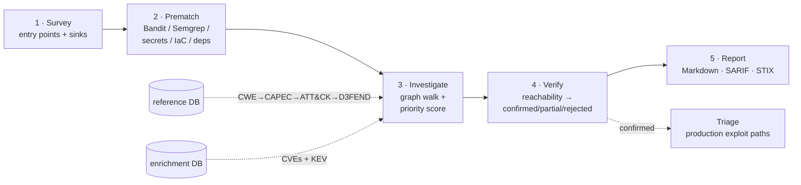

# 07 · Scanner Pipeline

The deep version of how a scan works. Five stages, each persisting to `<project>/.crossview/cohort.db`, each idempotent and independently runnable. The unifying idea: a SAST finding seeds a **hypothesis**, and the pipeline enriches, scores, and verifies that hypothesis against the MITRE graph and the live code.



```text
SURVEY ──▶ PREMATCH ──▶ INVESTIGATE ──▶ VERIFY ──▶ REPORT
  │           │              │             │          │
entry/      scan_         evidence +    confirmed/  Markdown
sinks       results +     validations + partial/    SARIF
            hypotheses    priority      rejected    STIX
```

---

## Stage 1 — Survey (`scanner/survey.py`, `harness/`)

**Goal:** build a structural map of the codebase — where untrusted input enters (*entry points*) and where dangerous operations happen (*sinks*).

`run_survey()` walks the tree via `harness/orchestrator.survey_tree()`, which ignores `.venv`, `node_modules`, `__pycache__`, `.git`, build/dist, migrations, and tests, then dispatches each file to a language **harness**.

### Harness model (`harness/base.py`)

```python
@dataclass
class Entrypoint:
    kind: str        # http_route | cli_command | event_handler | webhook | scheduled
    framework: str   # fastapi | flask | django | typer | click | express | hono | next | ...
    method: str | None
    path: str | None
    handler_name: str | None
    parameters: list[dict]

@dataclass
class Sink:
    kind: str        # sql_exec | shell_exec | code_eval | unsafe_deserialize |
                     # http_fetch | file_io | template_render | redirect | xxe | llm_call
    risk_cwe: list[str]   # candidate CWE IDs for this sink
    callee: str           # dotted function name
    snippet: str          # 1–3 lines of context
```

### Python harness (`harness/python/`)

AST-based. Parses each file, detects frameworks from imports (FastAPI, Flask, Django, Typer, Click, plus LLM SDKs: anthropic, openai, langchain, llama_index), then:

- **Entry points** (`routes.py`): FastAPI/Starlette method decorators, Flask `@route`, Django `path()`/`re_path()`, Typer/Click commands, and scheduler decorators (`@scheduler.scheduled_job`, `@celery.task`).
- **Sinks** (`sinks.py`): exact patterns (`subprocess.*`, `os.system`, `eval`/`exec`, `pickle.load*`, `yaml.load`, `requests.*`/`httpx.*`, `jinja2.*`, XML parsers) and suffix patterns (`.execute()`/`.executemany()` for SQL; `.messages.create`/`.chat.completions.create`/`.invoke` for LLM calls). Each sink carries its candidate `risk_cwe` (e.g. SQL → `CWE-89`, shell → `CWE-78`, LLM → `CWE-1426`).

### TypeScript harness (`harness/typescript/`)

Lighter weight — regex import detection + `ast-grep` patterns (no full TS parser). Frameworks: Next.js, Express, Hono, Fastify, NestJS, React, plus LLM SDKs. Sinks: `dangerouslySetInnerHTML`/`innerHTML`, `eval`/`new Function`, `child_process.*`, `fetch`/`axios`, redirects, `$DB.query()`, LLM client calls, `Handlebars.compile`.

### Persisted (cohort.db)

`entrypoints`, `sinks`, and a `project_map` row (languages, frameworks, counts). These three tables are what stages 2 and 4 consult for reachability.

---

## Stage 2 — Prematch (`scanner/prematch_*.py`)

**Goal:** run industry SAST tooling and turn every finding into a seeded hypothesis. Four sub-stages share one shape: **run tool → normalize to `Finding` → persist (`scan_results` → `investigation` → `hypothesis`)**.

### The normalized `Finding` (`sarif_ingest.py`)

```python
@dataclass
class Finding:
    rule_id: str
    rule_source: str   # bandit | semgrep | detect-secrets | trufflehog | gitleaks | osv-scanner | trivy | hadolint
    severity: str      # error | warning | note
    message: str
    file_path: str
    line_start: int | None
    line_end: int | None
    cwe_ids: list[str]
    raw: dict
```

`parse_sarif()` probes multiple SARIF locations for CWE references (rule `relationships` taxa, `properties.tags`, `properties.cwe`, result tags). Bandit doesn't emit SARIF in the pinned version, so `bandit_ingest.parse_bandit_json()` maps its native JSON (severity HIGH→error, MEDIUM→warning, LOW→note; preserves `issue_cwe`).

### 2a — Code SAST (`prematch_code.py`)

- **Bandit** (Python): JSON output, excludes vendor/test dirs.
- **Semgrep** (multi-language): SARIF output. Rule packs come from `preset_selector.select(languages, frameworks)`, which composes presets from `rules/presets.yaml` — Python base, TS/JS base, and the custom **ATLAS/LLM** pack when an LLM SDK is detected. See [Rules & Presets](09-rules-and-presets.md).

Both external tools are resolved portably via `scanner/tooling.resolve_tool()` (interpreter-relative → `PATH` → bare name).

### 2b — Secrets (`prematch_secrets.py`)

`detect-secrets` (high-signal plugins only; entropy detectors dropped as noisy), TruffleHog (filesystem; flags `Verified: true`), Gitleaks (git history → SARIF). All map to **CWE-798** (hardcoded credentials), seeded at confidence ~0.7.

### 2c — IaC / containers (`prematch_iac.py`)

Trivy (`fs --scanners vuln,misconfig,secret`) and Hadolint (per-Dockerfile). Both → SARIF → `Finding`. Skipped gracefully when the binaries are absent.

### 2d — Dependency CVEs (`prematch_deps.py`)

OSV-Scanner reads lockfiles, extracts CVE aliases, then **auto-joins against `enrichment.db`**: pulls each CVE's CWEs and checks CISA KEV, escalating severity to `error` and tagging the message when a dependency CVE is exploited in the wild. Seeded high (~0.8) since a known-CVE dependency is high-signal.

### Hypothesis seeding

For each finding: insert a `scan_results` row, open an `investigation` linked to it, and seed one `hypothesis` per distinct CWE (or a generic one if no CWE), with a starting `confidence` and `status='active'`. Re-running a prematch stage **clears that project's prior findings of the same source** before re-inserting, so it's idempotent.

---

## Stage 3 — Investigate (`scanner/investigate.py`)

**Goal:** for each active hypothesis, walk the MITRE graph, pull real CVE/KEV context, and compute a priority score.

### Graph walk — `walk_chain(ref_conn, cwe_id)`

Builds a `CrossSourceChain` by querying the reference DB:

```text
CWE ──child_of──▶ parent CWEs
CWE ──targets──▶ CAPEC   (and CAPEC ──uses_weakness──▶ CWE, unioned)
CAPEC ──related──▶ T#### (ATT&CK) / AML.T#### (ATLAS)
technique ──kill_chain_phase──▶ UKC-#
technique ◀──counters── D3FEND
```

### CVE enrichment — `cve_enrichment(enr_conn, cwe_id)`

Joins `cwe_cves` → `cves` (top-N by CVSS), flags each CVE's KEV membership, and counts KEV entries (and KEV-with-ransomware) by matching `kev.cwe_ids_json`.

### Priority score — `score_priority()`

Additive, capped at 1.0:

| Signal | Weight |
|---|---|
| scanner severity == `error` | +0.3 |
| any CVE in CISA KEV (exploited in the wild) | +0.4 |
| KEV entry with known ransomware use | +0.2 |
| max CVSS ≥ 9.0 | +0.2 |
| max CVSS ≥ 7.0 (if not already ≥9.0) | +0.1 |
| D3FEND mitigations available | +0.05 |

Label: `≥0.8 → high`, `≥0.5 → medium`, else `low`.

### Persisted

`evidence` rows (`kind` ∈ `mitre_xref` for the canonical entities, `external_ref` for CVEs/KEV, `test_result` for the priority rationale) and `validations` rows (one per discovered canonical entity, asserting it applies). The hypothesis `confidence` is updated to the priority score. With `--web-research N`, the top-N high-priority CWEs additionally get `run_enricher_sync("web_research", …)`.

---

## Stage 4 — Verify (`scanner/verify.py`)

**Goal:** confirm the finding is *still real and reachable* by re-surveying the live code. Only hypotheses at/above a priority floor (default 0.5) are verified.

`_verify_one()` returns a `Verdict(status, reason, confidence_delta)` from three signals:

- **`sink_at_line`** — the finding's line is a known sink from Stage 1.
- **entry-point co-residence** — the file *is* an entry point, or sits in an entry-point-bearing directory.
- **live sink nearby** — re-surveying the file finds a sink within ±2 lines (tolerates code drift).

| Situation | Verdict | Δconfidence |
|---|---|---|
| File no longer exists | `rejected` | −0.5 |
| entry-point file **and** sink at line | `confirmed` | +0.2 |
| sink at line **and** in entry-point module | `confirmed` | +0.15 |
| live sink nearby **and** in entry-point module | `confirmed` | +0.10 |
| in entry-point module (no exact sink match) | `confirmed` | +0.05 |
| sink at line but not entry-point-reachable | `partial` | 0.0 |
| present but no entry-point co-residence | `partial` | −0.05 |

`run_verify()` is idempotent — it resets previously-verified hypotheses to `active` before reclassifying. A `confirmed` verdict also flips the parent `investigation` to `validated`. Verdict reasoning is written as a `test_result` evidence row.

---

## Stage 5 — Report (`scanner/reporter.py`) & Triage (`scanner/triage.py`)

### Reporter

`run_report()` assembles the validated investigations and confirmed/partial hypotheses, resolves canonical entity names from the reference DB, and renders three outputs:

- **`CROSSVIEW-REPORT.md`** — confirmed vs. partial sections; per finding: location, rule, severity, CWE, the CAPEC→ATT&CK→ATLAS→D3FEND chain, CVE/KEV signal, and D3FEND mitigation links; plus a methodology appendix.
- **`CROSSVIEW-REPORT.html` / `.pdf`** — a client-grade, print-ready report (branded header, severity badges, summary stats, the cross-reference table, KEV signal, D3FEND mitigations). Self-contained: HTML always renders via Jinja2 (`report_html.py`); PDF uses WeasyPrint if installed (`crossview[pdf]`), else a headless Chromium (Playwright), else it's skipped with a note.
- **`CROSSVIEW.sarif`** — SARIF 2.1.0; confirmed→`error`, partial→`warning`; `crossview`-namespaced properties carry status/confidence/entities.
- **`CROSSVIEW.stix.json`** — STIX 2.1, confirmed only; `vulnerability` objects with CWE external refs and `exploited-using`/`mitigated-by` relationships.

### Triage

`run_triage()` is the production-focused complement. It `classify()`-ies each confirmed finding's path:

```text
build  ·  test  ·  dev  ·  config_template  ·  doc  ·  production
```

…drops everything that isn't `production`, then ranks the survivors:

1. **live_secret** — TruffleHog re-run with `--results=verified`: the credential authenticates *now*.
2. **kev_intersect** — CWE has a CISA KEV CVE and the finding is `error`-severity or a secret.
3. **atlas_llm** — `CWE-1426` or an `AML.T` reference (AI input-flow risk).
4. **production_other** — the rest.

Output: `CROSSVIEW-TRIAGE.md`. Use `--no-verify-secrets` to skip the live credential check.

---

## Confidence lifecycle, end to end

```text
seed (stage 2)      investigate (stage 3)       verify (stage 4)
─────────────       ─────────────────────       ────────────────
0.5  code/semgrep   confidence ← priority score  confidence ← clamp(prev + Δ, 0..1)
0.7  secrets        (KEV / CVSS / severity /      Δ ∈ [−0.5 .. +0.2]
0.6  IaC             D3FEND availability)         status ← confirmed | partial | rejected
0.8  deps
```

Re-running any stage is safe: prematch clears prior same-source findings; investigate rewrites evidence/validations; verify resets and reclassifies. The silo and enrichment DBs are read-only from the scanner's perspective.
