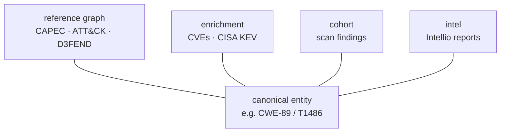

# 12 · Intel Mindmeld (Intellio ↔ Crossview)

Crossview's **intel** layer fuses [Intellio](https://ai.studio/apps) — an LLM-powered cyber-intelligence *report generator* — into Crossview's persistent knowledge graph, turning Crossview into a **multispectrum knowledge tool**.

## Why they fuse

The two tools are complementary opposites:

| | Intellio | Crossview |
|---|---|---|
| Produces | Narrative LLM reports (threat-intel, vulnerability, red/blue-team tool, engineering) | Canonical, cross-referenced MITRE graph + CVE/KEV + scan findings |
| Persistence | **None** — reports are ephemeral, session-scoped | SQLite silo + enrichment + per-project cohort |
| Grounding | Web grounding only; no local knowledge base | The whole MITRE graph, offline |
| Narrative | Rich briefs, timelines, chat | **None** — structured data only |

Crucially, Intellio reports already speak Crossview's vocabulary — ATT&CK technique IDs, CWE/CAPEC/CVE/CPE, CISA KEV, CVSS. So an Intellio report can be **grounded** against Crossview's silo and **persisted** as a first-class node, cross-linked to the canonical entities it mentions.

## What the mindmeld adds: a fourth spectrum

Crossview already holds three "spectra" of knowledge, all keyed by canonical entity ID:

```text
reference (crossview.db)  — canonical taxonomy:      CWE-89, T1059, CAPEC-66 …
enrichment (enrichment.db)— live exploitation:        CVEs, CISA KEV
cohort (<proj>/cohort.db) — your code's findings:     hypotheses, scan results
intel (intel.db)          — narrative intelligence:   Intellio reports   ← NEW
```

Every spectrum points *into* the reference graph by entity ID. Add intel, and a single CWE now connects to its attack patterns and defenses (reference), the CVEs exploiting it (enrichment), where it appears in your codebase (cohort), **and the threat-intel reports that discuss it** (intel).



## The intel layer

`crossview/intel/` stores reports in a dedicated `intel.db` (the reference silo stays a clean, rebuildable source of truth):

- **`intel_reports`** — one row per ingested report (`subject`, `report_type`, `summary`, full `payload_json`, `origin`).
- **`intel_refs`** — every canonical ID the report mentions, with whether it **resolved** against the silo/enrichment and the resolved name. This is the cross-link into the graph.

Ingestion (`intel.ingest_report`) does three things:

1. **Extract** every canonical ID in the report (regex over ATT&CK `T####`, ATLAS `AML.T####`, `CWE-`, `CAPEC-`, `CVE-`, `CPE`, `D3F:`, `UKC-`).
2. **Ground** each against the reference DB (and CVEs against enrichment) — resolved vs. unresolved.
3. **Persist** the report + its grounded references, idempotently on `(subject, report_type)`.

## CLI

```bash
crossview intel generate "CVE-2021-44228"  # GENERATE a grounded report in-process, then persist
crossview intel ingest report.json   # persist + ground an existing Intellio report JSON
crossview intel list                 # stored reports + grounding coverage
crossview intel show WannaCry         # a report's summary + its grounded cross-references
crossview intel citing T1486          # reverse link: which intel reports cite this entity
crossview intel citing CWE-89         # …the multispectrum query
```

`generate` accepts `--type` (force a class), `--model` (override the Gemini model),
and `--no-store` (print JSON without persisting).

Example — ingesting a WannaCry threat-intel report grounds 6/6 references and makes them queryable from the graph side:

```text
✓ WannaCry (threat-intel) — grounded 6/6 refs (100%)
  CAPEC-66  capec   SQL Injection
  CVE-2017-0144  cve  The SMBv1 server in Microsoft Windows…
  CWE-89  cwe  Improper Neutralization of Special Elements…
  D3F:Token_Binding  d3fend  Token Binding
  T1059  attack  Command and Scripting Interpreter
  T1486  attack  Data Encrypted for Impact

$ crossview intel citing T1486
  WannaCry  threat-intel  via attack
```

## Programmatic use

```python
from crossview import intel
from crossview.data.database import connect as ref_connect
from crossview.enrichment.cache import connect as enr_connect

ic, rc, ec = intel.connect(), ref_connect(), enr_connect()
res = intel.ingest_report(report_dict, ic, rc, ec)   # report_dict = an Intellio AnyReport
intel.reports_citing(ic, "CWE-89")                    # cross-spectrum reverse query
```

## Ingesting from Intellio

Intellio exposes `POST /api/report` returning the report JSON (see its `types.ts` `AnyReport`). Any of these feed `crossview intel ingest`:

- Save an Intellio report to JSON and ingest the file.
- `curl` Intellio's API and pipe the response to a file, then ingest.

## Roadmap (full mindmeld)

Ingest/ground/persist **and in-process generation** are built and tested.

- **`crossview intel generate <subject>`** ✅ — Intellio's Gemini-grounded generators ported to Python ([crossview/intel/generate.py](../crossview/intel/generate.py)): same classification heuristics, the same per-type prompts, and the same Google-Search grounding tool (models `gemini-3-pro-preview` → `gemini-2.5-flash` fallback). It generates the report in-process, then auto-grounds + persists it. Needs `GEMINI_API_KEY`.

Planned extensions:

- **GraphQL** — expose intel nodes (`intelReports`, `reportsCiting(entityId)`) alongside the existing schema.
- **Cohort ↔ intel** — surface relevant intel reports next to scan findings (a finding's CWE → the threat-intel discussing it), and in `CROSSVIEW-REPORT.md`.
- **Chat over the grounded graph** — Intellio-style follow-up Q&A, but answered from the persisted, cross-referenced silo rather than a one-shot LLM call.
