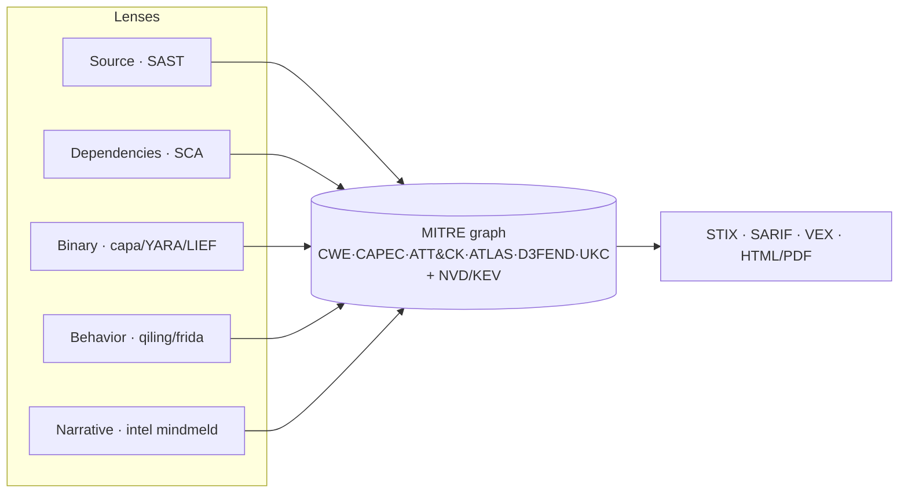
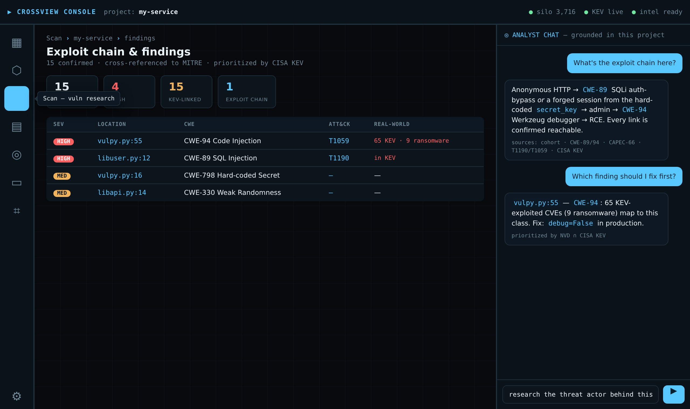

# 14 · Vision — the multispectrum console

Where Crossview is heading: from a CLI/TUI security tool into a **self-hosted, MITRE-grounded analyst workbench** — many analysis lenses feeding one cross-referenced graph, surfaced through a desktop console with a grounded chat.

This is a north-star doc, not a spec for shipped features. Today's shipped surface is the CLI/TUI/GraphQL; everything past "Lenses" is roadmap.

## The principle: lenses on one spine

The product is the **graph + correlation**; analyzers are pluggable lenses that all map onto the same MITRE spine and emit the same standard formats.

The discipline: keep every lens "good enough to feed the graph"; out-differentiate on *breadth of correlation*, not depth in any single lens.

## Three use cases, one engine

Each use case is self-contained — **a detailed report + a video + its research artifacts** — sharing the report engine and the graph:

| Use case | Lens | Report |
|---|---|---|
| Vulnerability Research / Exploit Chain | source SAST | findings report (HTML/PDF) ✅ |
| OSCTI | narrative intel | threat-intel report |
| Binary Analysis | binary/dynamic | artifact report |

## The enabling seam: `crossview serve`

The CLI/TUI already have an **in-process GraphQL schema**. Exposing it over HTTP (`strawberry.asgi`) gives any front-end — web or desktop — a backend to drive Crossview, **without duplicating logic in the UI**. This is the small step that unlocks the console.

## The console

A desktop (Electron) **thin client over the Python engine** (GraphQL + CLI as a sidecar). The Python core stays the single source of truth; the UI never reimplements scanning or graph logic.

- **Icon + tooltip navigation rail** (left) — one workspace per lens/tool: Overview · Silo · Scan · Binary · OSCTI · Reports · Query · Settings.
- **Workspace** (center) — the active tool (findings table, graph browser, report viewer, GraphQL console).
- **Grounded analyst chat** (right) — the intel layer answering from *this project's* cross-referenced graph (not a generic chatbot): "what's the exploit chain here?", "which finding first?", "research the actor behind this technique" — with sources cited from cohort / CWE / ATT&CK / KEV.
- **Status bar** — silo size, KEV freshness, intel readiness.

This is the OpenCTI / Recorded-Future-style analyst console — self-hosted, code-aware, at a fraction of the cost.

## Honest caveats

- The console is a **distinct, multi-quarter front-end project**, separate from the engine. Packaging Python-in-Electron (sidecar process) is real work.
- A desktop app that scans + runs LLMs needs deliberate **trust boundaries** (the project's zero-trust posture).
- Keep logic in Python; the UI is a thin client. Resist forking analysis into JS.

## Phased roadmap

1. **Now** — CLI/TUI/GraphQL, the silo, enrichment, the intel mindmeld, HTML/PDF reports.
2. ✅ **Report-per-use-case** — the report engine ([`crossview/reporting.py`](../crossview/reporting.py)) renders `{findings | intel | artifact}`; `crossview report` and `crossview intel report` produce HTML/PDF, and each use case ships its report + video.
3. **Binary lens** — `binscan` v1 (LIEF + capa→ATT&CK + YARA → STIX), graceful-optional. *(artifact report renderer already scaffolded.)*
4. ✅ **`crossview serve`** — HTTP GraphQL seam (`pip install crossview[serve]`), the backend any front-end drives.
5. **Console** — Electron thin client: icon-rail navigation, lens workspaces, grounded chat.
6. **Optional** — dynamic analysis (qiling/frida) and a deliberate DFIR fork (Volatility/plaso).
