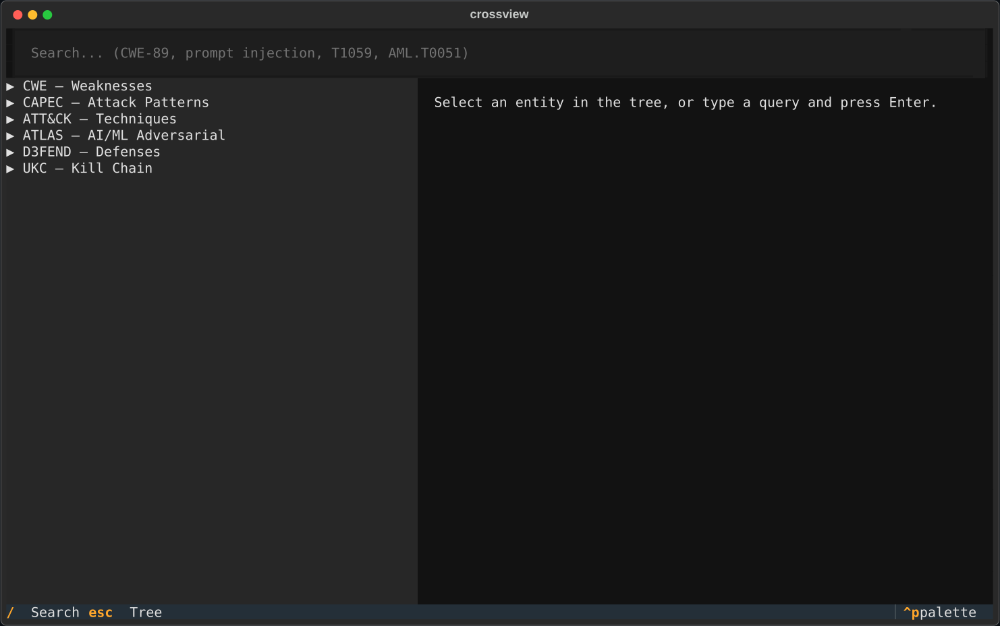
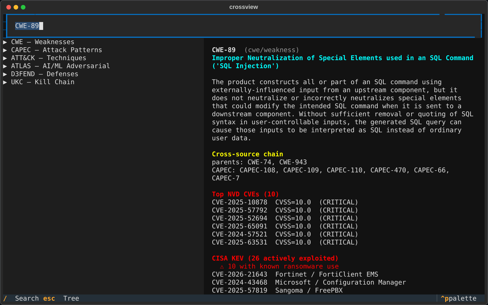
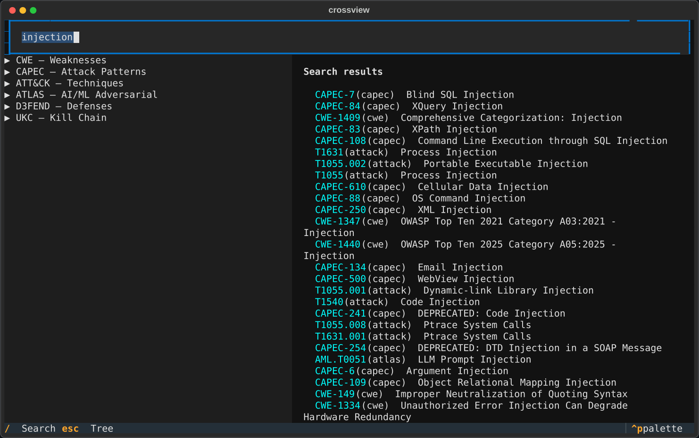
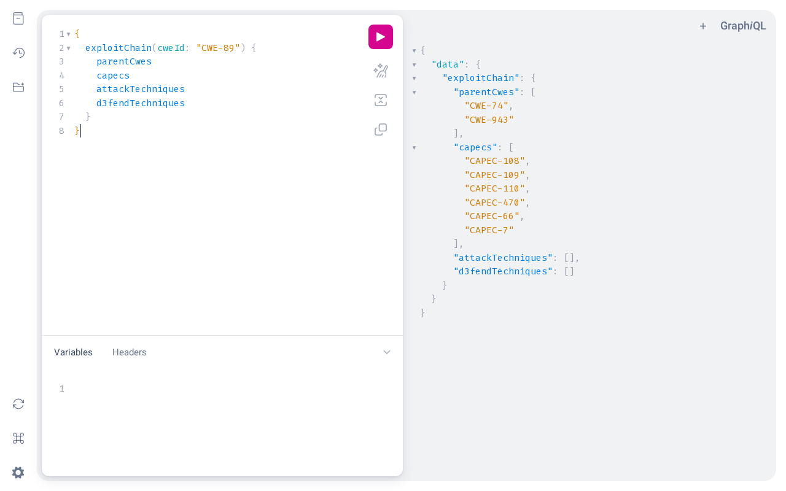
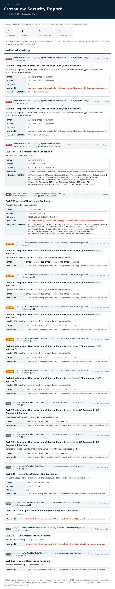
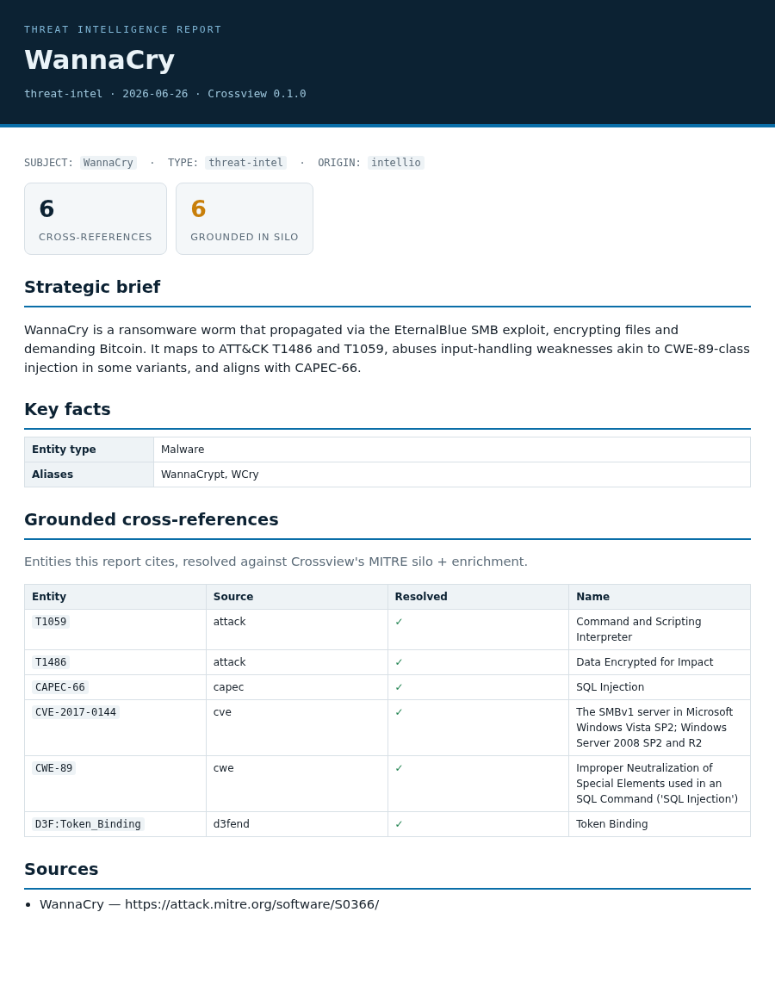

# 15 · UI Screens

Crossview's current interactive surfaces, captured from the running app. Regenerate
them all with:

```bash
python3 scripts/capture_ui.py            # tui · web · report → docs/assets/ui/
```

> **On the desktop console:** there is no Electron app yet — it's the roadmap in
> [the vision](14-vision.md), and only a static mockup exists (bottom of this page).
> When it ships, its screens are captured the same way via Playwright's Electron
> driver (`playwright._electron`) + the DevTools protocol, added as an `electron`
> surface to the same generator.

## TUI — the terminal app (`crossview tui`)

A Textual app: a tree of the silo by source, a search box, and a detail panel.

**Overview** — the MITRE knowledge silo by source:



**Detail** — search an ID (e.g. `CWE-89`) → the entity, its cross-source chain, top CVEs, and CISA KEV:



**Search** — full-text across the whole silo:



## Web — the GraphQL server (`crossview serve`)

`crossview serve` exposes the schema over HTTP with GraphiQL in the browser — the
backend any front-end (including the future console) drives:



## Reports — HTML / PDF (`crossview report`, `crossview intel report`)

Client-grade, print-ready reports shipped with every scan and intel run.

**Security report** (Vulnerability Research / Exploit Chain):



**Threat-intelligence report** (OSCTI):



## Console — desktop app (roadmap, not built)

A design mockup of the Electron console (icon + tooltip navigation, lens workspaces,
grounded analyst chat). See [the vision](14-vision.md). This is **not** a running app
yet — it's the target.


