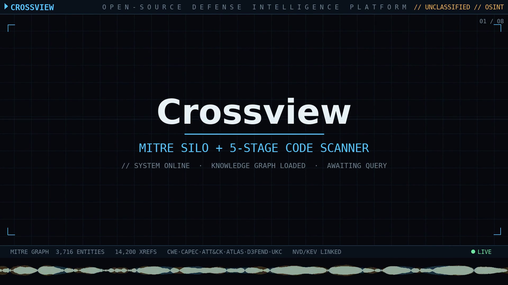

# Crossview demo video



A ~83-second narrated product demo styled as a **defense-intelligence platform HUD**: classification banners, a live telemetry status bar, a dark grid, corner reticles, reticle-framed screenshots, a subtle Ken-Burns push per slide, a sweeping scanline, and a waveform band. It walks the real screenshots (`show` → `search` → `dev stats` → TUI → GraphQL → `scan`) over an original Gemini music bed with OpenAI narration.

> **The rendered video lives in the internal media library**, not the repo:
> `~/Videos/visionlighter/crossview/product-demo/crossview-demo.mp4`. The poster above
> previews it; regenerate with `python3 scripts/build_demo.py`.

## How it was made

A fully tool-driven pipeline — no hand-editing:

| Stage | Tool | Output |
|---|---|---|
| Screenshots | `scripts/gen_screenshots.py` | `docs/assets/*.png` (the slides, in repo) |
| Music bed | **Gemini Lyria 3** (`gemini-music-skill`) | `crossview-bed.mp3` (84 s, original) |
| Narration | **OpenAI TTS** (`audio-orchestrator`) | `vo/*.mp3` (8 segments) |
| Compose + render | `ffmpeg` + Pillow (`scripts/build_demo.py`) | `crossview-demo.mp4` |

The narration script and slide mapping live in [`assets/manifest.json`](assets/manifest.json) (kept in the repo). The heavy media — the music bed, the VO clips, and the rendered video — live in the media library under `product-demo/` (with `crossview-bed.gemini.json` recording the exact music prompt/model).

## Regenerating

The render is deterministic given the media-library assets. Paths resolve via
`CROSSVIEW_MEDIA_DIR` (default `~/Videos/visionlighter/crossview`):

```bash
python3 scripts/build_demo.py     # → <media>/product-demo/crossview-demo.mp4
```

Regenerating the **music** or **narration** requires API keys (`GEMINI_API_KEY`, `OPENAI_API_KEY`) and network — those steps cost money, which is why the generated audio is kept in the media library so the video can be rebuilt offline.

> The reusable, spec-driven version of this composition (cards, captions, Ken-Burns motion, animated text, narration + ducked music, visualizer band) lives in the **`video-jockey`** skill as `render_sequence.py` — this demo is its reference example.

## Where the assets live

| Kept in the repo (necessary) | In the media library (auxiliary) |
|---|---|
| `poster.png`, `assets/manifest.json`, `scripts/build_demo.py` | `crossview-demo.mp4`, `build-assets/crossview-bed.mp3`, `build-assets/vo/` |

This keeps the repo lean while the heavy media stays in `~/Videos/visionlighter/crossview/`.
